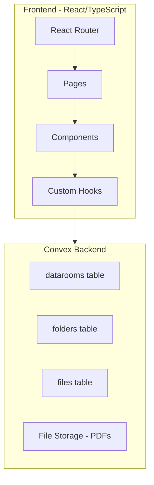
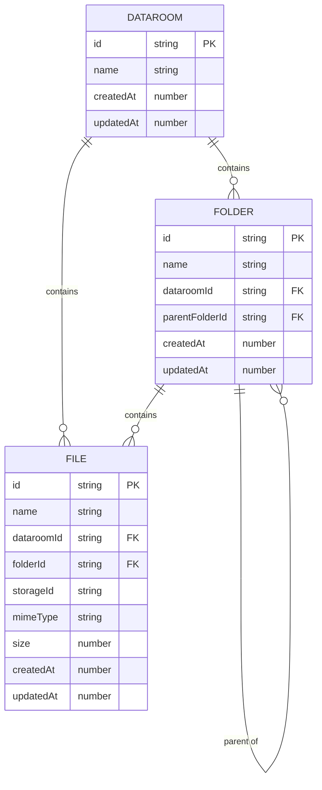

# Data Room Application MVP

## Architecture Overview



## Data Model (Convex Schema)



## Routing Structure

| Route | Page | Description |

| ---------------------------------------- | -------- | ----------------------------- |

| `/` | Home | List all datarooms |

| `/dataroom/:dataroomId` | Dataroom | Root contents of a dataroom |

| `/dataroom/:dataroomId/folder/:folderId` | Folder | Contents of a specific folder |

Search persisted via `?search=term` query parameter on all routes.

## Key Files to Create/Modify

### 1. Setup and Infrastructure

- Install dependencies: `react-router-dom`, additional shadcn components (dialog, dropdown-menu, alert-dialog, tooltip, skeleton, toast/sonner)
- Create Convex schema in [`convex/schema.ts`](convex/schema.ts)
- Create Convex functions in [`convex/datarooms.ts`](convex/datarooms.ts), [`convex/folders.ts`](convex/folders.ts), [`convex/files.ts`](convex/files.ts)
- Add ConvexProvider wrapper in [`src/frontend.tsx`](src/frontend.tsx)

### 2. Component Structure

```
src/
├── components/
│   ├── layout/
│   │   └── AppLayout.tsx          # Main layout wrapper
│   ├── dataroom/
│   │   ├── DataroomList.tsx       # Grid of dataroom cards
│   │   ├── DataroomCard.tsx       # Individual dataroom card
│   │   └── CreateDataroomDialog.tsx
│   ├── explorer/
│   │   ├── FileExplorer.tsx       # Main content area
│   │   ├── Breadcrumbs.tsx        # Navigation breadcrumbs
│   │   ├── ItemGrid.tsx           # Grid/list of folders & files
│   │   ├── FolderCard.tsx         # Folder item with actions
│   │   ├── FileCard.tsx           # File item with actions
│   │   ├── CreateFolderDialog.tsx
│   │   ├── UploadFileDialog.tsx
│   │   ├── RenameDialog.tsx
│   │   └── DeleteConfirmDialog.tsx
│   ├── preview/
│   │   └── FilePreviewDialog.tsx  # PDF preview in dialog
│   ├── shared/
│   │   ├── EmptyState.tsx
│   │   ├── ItemContextMenu.tsx    # Right-click/dropdown menu
│   │   └── ThemeToggle.tsx
│   ├── Header.tsx                 # Update existing
│   └── SearchInput.tsx            # Update to use URL params
├── pages/
│   ├── HomePage.tsx
│   ├── DataroomPage.tsx
│   └── FolderPage.tsx
├── hooks/
│   ├── useSearch.ts               # Search with URL sync
│   └── useTheme.ts
├── lib/
│   ├── utils.ts                   # Existing
│   └── validation.ts              # Name validation helpers
└── types/
    └── index.ts                   # Shared TypeScript types
```

### 3. Key Features Implementation

**Duplicate Name Validation**: Before creating/renaming folders or files, check if a sibling with the same name exists in the same location.

**Cascading Delete**: When deleting a folder, recursively delete all nested folders and files (handled in Convex mutation).

**Search**: Update [`src/components/SearchInput.tsx`](src/components/SearchInput.tsx) to sync with URL `?search=` param using `useSearchParams` from react-router-dom.

**File Preview**: Embed PDF in dialog using `<iframe>` or `<embed>` with Convex storage URL.

**Theme Toggle**: Store preference in localStorage, apply `.dark` class to root element.

## UI/UX Design (Google Drive-inspired)

- Clean, minimal header with logo, centered search, and action buttons
- Card-based grid layout for datarooms, folders, and files
- Context menus (right-click or kebab menu) for item actions
- Breadcrumb navigation within datarooms
- Loading skeletons while fetching data
- Toast notifications for success/error feedback
- Empty states with helpful prompts

## Edge Cases to Handle

1. Duplicate file/folder names in same location - show validation error
2. Deleting non-empty folders - show confirmation with item count
3. Large file uploads - show progress indicator
4. File type validation - only accept PDF files
5. Empty search results - show helpful message
6. Network errors - show error toasts with retry option

## Deployment Considerations

- Convex handles backend hosting automatically
- Frontend deployable to Vercel with `bun run build`
- Environment variable: `CONVEX_URL` for Convex deployment
