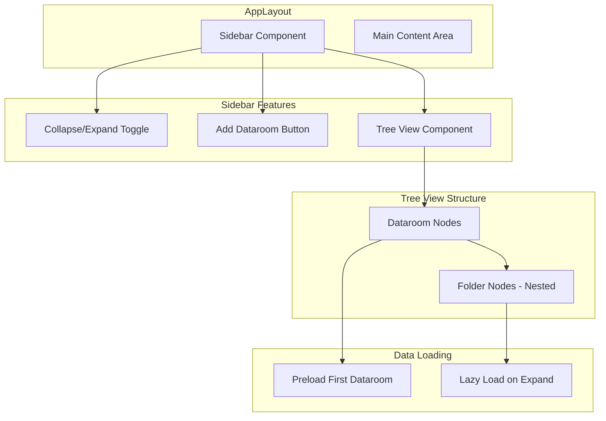

# Sidebar Tree View Implementation

## Overview

Add a collapsible sidebar (wide, ~300-350px) to the application that displays a tree view of all datarooms and their nested folders. The sidebar will include a button to add datarooms at the top, support collapsible/expandable items, use different icons for datarooms vs folders, and implement lazy loading for performance.

## Architecture

## Implementation Details

### 1. Create Sidebar Component

**File**: [`src/components/layout/Sidebar.tsx`](src/components/layout/Sidebar.tsx)

- Collapsible sidebar with toggle button (hamburger/chevron icon)
- Fixed width when expanded (~300-350px), collapsed width (~60px)
- "Add Dataroom" button at the top (only visible when expanded)
- Tree view component below the button
- Store collapsed state in localStorage for persistence
- Use smooth transitions for expand/collapse

### 2. Create Tree View Component

**File**: [`src/components/layout/SidebarTreeView.tsx`](src/components/layout/SidebarTreeView.tsx)

- Recursive tree structure for nested folders
- Each dataroom and folder is collapsible
- Different icons:
    - Dataroom: Use `Folder` or `Database` icon from lucide-react
    - Folder: Use `Folder` icon from lucide-react
- Click handlers to navigate to dataroom/folder routes
- Active route highlighting (match current URL path)
- Indentation for nested folders

### 3. Create Tree Node Components

**File**: [`src/components/layout/SidebarTreeNode.tsx`](src/components/layout/SidebarTreeNode.tsx)

- Individual tree node component (handles both datarooms and folders)
- Expand/collapse chevron icon
- Icon for dataroom/folder
- Name display
- Click handler for navigation
- Active state styling
- Loading state for lazy-loaded folders

### 4. Update Convex Queries

**File**: [`convex/folders.ts`](convex/folders.ts)

- Add `getAllByDataroom` query to fetch all folders for a dataroom (for tree building)
- This will be used to build the tree structure efficiently
- Consider adding a query that returns folders in a tree-friendly format

**File**: [`convex/datarooms.ts`](convex/datarooms.ts)

- Ensure `list` query is optimized for sidebar use

### 5. Lazy Loading Strategy

**File**: [`src/components/layout/SidebarTreeView.tsx`](src/components/layout/SidebarTreeView.tsx)

- Track expanded state for each dataroom and folder
- On initial load:
    - Fetch all datarooms
    - Preload folders for the first dataroom only
    - Other datarooms start collapsed
- On expand:
    - Load folders for that dataroom/folder if not already loaded
    - Use Convex `useQuery` with conditional args based on expanded state
- Cache loaded folder data to avoid re-fetching

### 6. Update AppLayout

**File**: [`src/components/layout/AppLayout.tsx`](src/components/layout/AppLayout.tsx)

- Add Sidebar component before main content
- Use flexbox layout: sidebar + main content
- Adjust main content padding/margin when sidebar is collapsed
- Ensure responsive behavior (consider hiding sidebar on mobile)

### 7. Integration with Routing

- Use `useLocation` from react-router-dom to detect active route
- Highlight active dataroom/folder in sidebar
- Navigate on click using `useNavigate` or `Link` components
- Sync sidebar state with URL changes

### 8. State Management

- Use React state for:
    - Sidebar collapsed/expanded state (persist in localStorage)
    - Expanded datarooms/folders (can use Set or Map)
    - Loaded folder data cache
- Consider using a custom hook: `useSidebarState` for state management

## Key Features

1. **Collapsible Sidebar**
    - Toggle button (hamburger menu icon)
    - Smooth animation
    - Persist state in localStorage

2. **Add Dataroom Button**
    - Positioned at top of sidebar
    - Only visible when sidebar is expanded
    - Reuse existing `CreateDataroomDialog` component

3. **Tree View**
    - Hierarchical display of datarooms → folders → nested folders
    - Indentation for visual hierarchy
    - Expand/collapse chevrons

4. **Icons**
    - Dataroom: `Database` or `Folder` icon (distinct from folder)
    - Folder: `Folder` icon
    - Use lucide-react icons

5. **Performance**
    - Preload only first dataroom's folders
    - Lazy load on expand
    - Cache loaded data

6. **Active Highlighting**
    - Highlight current dataroom/folder based on route
    - Visual distinction (background color, border, etc.)

## Files to Create

- [`src/components/layout/Sidebar.tsx`](src/components/layout/Sidebar.tsx) - Main sidebar component
- [`src/components/layout/SidebarTreeView.tsx`](src/components/layout/SidebarTreeView.tsx) - Tree view component
- [`src/components/layout/SidebarTreeNode.tsx`](src/components/layout/SidebarTreeNode.tsx) - Individual tree node
- [`src/hooks/useSidebarState.ts`](src/hooks/useSidebarState.ts) - Sidebar state management hook

## Files to Modify

- [`src/components/layout/AppLayout.tsx`](src/components/layout/AppLayout.tsx) - Add sidebar to layout
- [`convex/folders.ts`](convex/folders.ts) - Add `getAllByDataroom` query for tree building

## Styling Considerations

- Use shadcn/ui components for consistency
- Dark/light theme support (already implemented)
- Smooth transitions for expand/collapse
- Hover states for tree nodes
- Active state styling
- Responsive design (consider mobile behavior)

## Edge Cases

1. Empty datarooms - show dataroom but no expand icon if no folders
2. Deep nesting - ensure indentation doesn't overflow sidebar width
3. Long names - truncate with ellipsis
4. Rapid expand/collapse - prevent multiple simultaneous queries
5. Route changes - update active highlighting
6. New dataroom/folder created - refresh tree view
7. Deleted items - remove from tree view

## Testing Considerations

- Test expand/collapse functionality
- Test lazy loading behavior
- Test navigation on click
- Test active highlighting
- Test with many datarooms and deeply nested folders
- Test sidebar collapse/expand persistence
